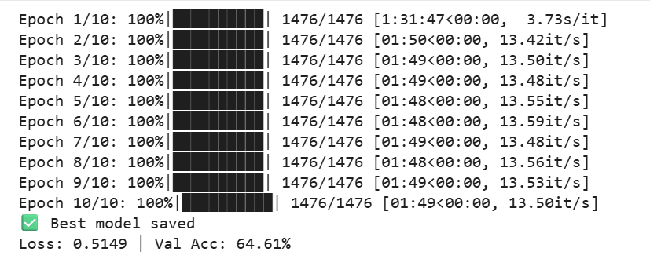
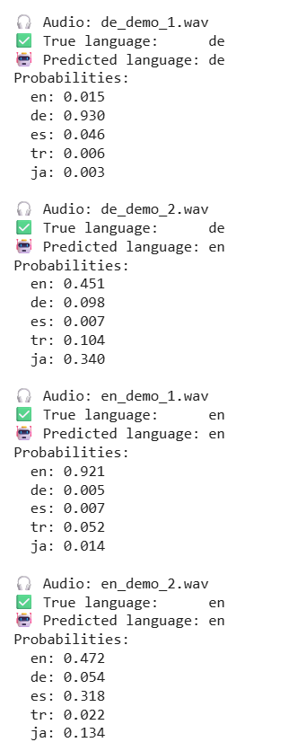

# 🎤 Language Identification (LID) Project

This project focuses on **Language Identification (LID)** —
recognizing the spoken language from audio recordings using speech processing and deep learning.

---

## ✨ Methods Implemented

### 1. CNN-Based Deep Learning Model
📓 Notebook: `notebooks/01_CNN_Method.ipynb`

- Trained across multiple epochs  
- Evaluated using accuracy and confusion matrix  

---

### 2. MFCC Feature-Based Approach
📓 Notebook: `notebooks/02_MFCC_Method.ipynb`

- Extracted MFCC speech features  
- Built classification pipeline  
- Compared results with CNN model  

---

## 📊 Results

Both approaches include:

✅ Epoch training logs  
✅ Accuracy percentages  
✅ Confusion Matrix evaluation  

---

## 📊 CNN Method Results

### Training Performance

### Sample Predictions

Validation Accuracy: **64.61%**

---

## ⚙️ Tools

- Python  
- Google Colab  
- Librosa  
- TensorFlow / PyTorch  

---

## 🌷 Author

Made with 💗 by **Buse**  
SheBuildsSTEM Platform
